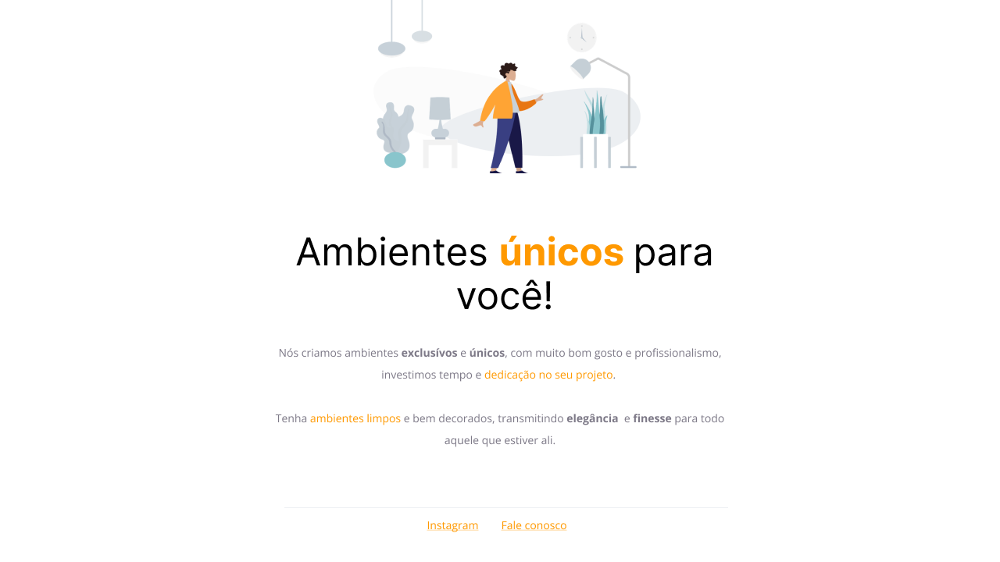

# Projeto para uma primeira página
# Projeto Rocketseat

<h1 align="center"> Page </h1>

 

  <a href="#-tecnologias">Tecnologias</a>&nbsp;&nbsp;&nbsp;|&nbsp;&nbsp;&nbsp;
  <a href="#-projeto">Projeto</a>&nbsp;&nbsp;&nbsp;|&nbsp;&nbsp;&nbsp;
  <a href="#-layout">Layout</a>&nbsp;&nbsp;&nbsp;|&nbsp;&nbsp;&nbsp;
  <a href="#memo-licença">Licença</a>

  

 

  

## 🚀 Tecnologias

Esse projeto foi desenvolvido com as seguintes tecnologias:

- HTML e CSS
- Git e Github
- Figma

## 💻 Projeto

A page é uma exemplificação de uma primeira página para uma empresa de móveis planejados, apresenta um modelo simples de aplicação em HTML e CSS.

- [Acesse o projeto finalizado, online](https://fellypsb.github.io/page/)

## 🔖 Layout

Você pode visualizar o layout do projeto através [DESSE LINK](https://www.figma.com/design/SpOiXoVINtES7kzRabvr8Z/Explorer---Page?m=auto&t=ycdKatjWQOC6onI3-6). É necessário ter conta no [Figma](https://figma.com) para acessá-lo.

## 📝 Licença

Esse projeto está sob a licença MIT.

---

Esse projeto só foi possível graças a Rocketseat 🚀 [Participe da nossa comunidade!](https://discord.gg/rocketseat)   
Powered by Fellype
